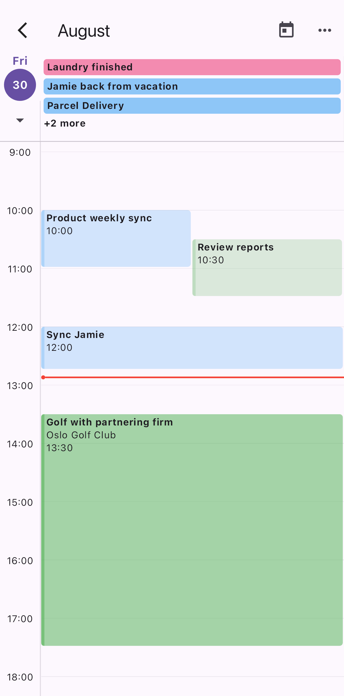
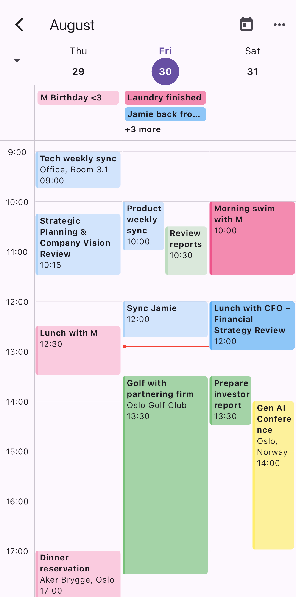
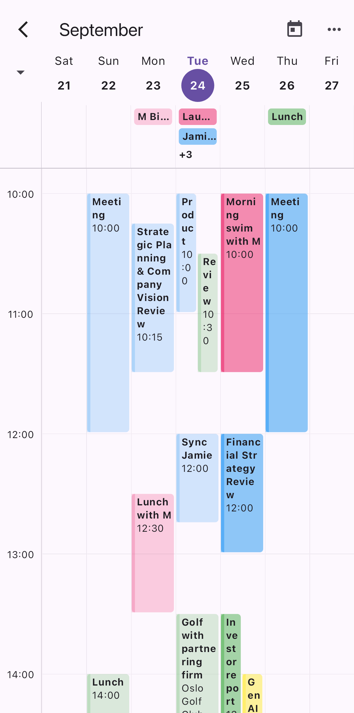

<!--
This README describes the package. If you publish this package to pub.dev,
this README's contents appear on the landing page for your package.

For information about how to write a good package README, see the guide for
[writing package pages](https://dart.dev/tools/pub/writing-package-pages).

For general information about developing packages, see the Dart guide for
[creating packages](https://dart.dev/guides/libraries/create-packages)
and the Flutter guide for
[developing packages and plugins](https://flutter.dev/to/develop-packages).
-->

`VisualsCalendar` is a highly customizable calendar widget that supports **day**, **week** and  **3-day** formats. It displays a header with the current month and provides options for event selection, custom styling, and asynchronous event loading.

## Features

- Customizable calendar styles,
- User definied events,
- Compatible with future events,
- Scroll and vertical zoom,
- Supports various views (e.g., daily, 3-day, weekly)




## Getting started

To install the package, add it to your `pubspec.yaml`:
```bash
flutter pub add visuals_calendar
```

## Usage

- Create a set of events, see event type further down.

```dart
List<Event> events = [
  Event(DateTime.now(), 'Event 1', Colors.pink),
  Event(DateTime.now().add(const Duration(hours: 3)), 'Event 2', Colors.blue),
  Event(DateTime.now().add(const Duration(hours: 5)), 'Event 3', Colors.green),
];
```

- Use the VisualsCalendar widget with your events.

```dart
class VisualsApp extends StatelessWidget {
  const VisualsApp({super.key});

  @override
  Widget build(BuildContext context) {
    return Scaffold(
      body: VisualsCalendar(
        events: events,
        defaultFormat: CalendarFormat.week,
        selectionEnabled: true,
      ),
    );
  }
}
```

## Event Type Documentation

The `Event` class represents a calendar event with a start and end time, title, color, and other optional properties like location and description.

## Constructor

```dart
Event(
  this.start,
  this.title,
  this.color, {
  this.end,
  this.isAllDay,
  this.description,
  this.location,
  this.onTap,
});
```

## Constructor Parameters and customization

```dart
VisualsCalendar({
  required this.defaultFormat,
  this.events,
  this.futureEvents,
  this.eventBuilder,
  this.appBarBuilder,
  this.selectionEnabled,
  this.onTimeSelected,
  this.style,
})
```

### defaultFormat 
```dart 
CalendarFormat
```
Required.
Defines the default display format for the calendar.
Available formats are [CalendarFormat.day, CalendarFormat.threedays, CalendarFormat.week].

### events 
```dart
List<Event>?
```
A list of Event objects to display on the calendar. Each Event includes details such as a title and date.

### futureEvents 
```dart
Future<List<Event>>?
```
Provides events asynchronously through a Future. While the future is being resolved, a loading indicator is shown on the calendar.

### eventBuilder
```dart
Widget Function(BuildContext context, Event event)?
```
A function used to build custom event tiles.
Allows for full control over how individual events are displayed.

### appBarBuilder
```dart
AppBar Function(BuildContext context, String currentMonth, void Function() setToday, void Function(CalendarFormat) setFormat, List<CalendarFormat> availableFormats)?
```
A custom AppBar builder. Provides customization for the app bar, including the current month, a button to jump to today, and the ability to switch between day and week formats.

### selectionEnabled
```dart
dart(bool?)
```
Enables or disables the selection functionality for creating new events. When true, users can select time slots to create events.

### onTimeSelected
```dart
void Function(DateTime start, DateTime end)?
```
A callback function triggered when a time range is selected. It provides the start and end times of the selected range. Requires selectionEnabled to be true.
Useful when allowing users to create new events directly from the calendar.

### style
```dart
CalendarStyle?
```
Allows customization of the calendar's appearance. You can define styles for different parts of the calendar, such as the background, text, and event tiles.


## Contributing

# How to Contribute
- Fork the repository.
- Clone your fork and create a new branch.
- Submit a pull request with your changes.

# Open Issues and Roadmap
- Check out the current issues and planned features on GitHub Issues.

# Development Guidelines
- Follow our coding standards and testing strategies.
- Make sure to write unit tests for any new features.

# How to Get in Touch
- Join the community on GitHub Discussions or our Slack channel.
